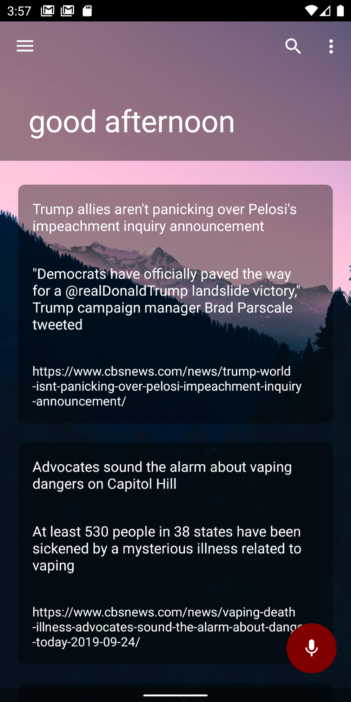

<h1 align="center">Welcome to Ara for Android 👋</h1>
By Andromeda Software

 an ai app for almost any android phone. Using the latest AI tools such as tensorflow.
 
 

## Author

👤 **Fulton Browne**

* Github: [@FultonBrowne](https://github.com/FultonBrowne)

## 🤝 Contributing

Contributions, issues and feature requests are welcome! Feel free to check [issues page](https://github.com/andromeda-software/Ara-android/issues).
If you contribute please commit to a new branch and explain details in your pull request not in your commit.

## Show your support

Give a ⭐️ if this project helped you!

## TODO
* Expand voice support
* IOT support
* Skills SDK

## 📝 License

Copyright © 2019 [Fulton Browne](https://github.com/fultonbrowne). 
This project is [ GPL-3.0](https://www.gnu.org/licenses/gpl-3.0.en.html) licensed.

***
_This README was generated with ❤️ by [readme-md-generator](https://github.com/kefranabg/readme-md-generator)_
